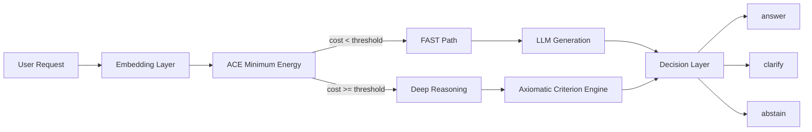

# ACE Semantic Gateway

Semantic middleware for LLMs that routes requests using the ACE Minimum Energy Criterion and deep axiomatic reasoning.

## Overview

ACE Semantic Gateway is an orchestration layer for language model systems.

It evaluates incoming requests through a semantic stability criterion before deciding how the system should respond.

The gateway uses two levels of analysis:

1. **ACE Minimum Energy Criterion** for fast semantic screening  
2. **Axiomatic Criterion Engine** for deep reasoning when semantic deviation is high  

This makes the gateway suitable for systems that require stronger control over semantic drift, hallucination risk, and unstable responses.

---

## Core Idea

A request enters the gateway and is first evaluated with the **ACE Minimum Energy Criterion**.

- If the semantic cost is low, the request follows the **FAST path**
- If the semantic cost is high, the request is escalated to **deep axiomatic analysis**

This allows the system to remain lightweight for well-grounded inputs while still providing stronger reasoning when ambiguity or semantic instability is detected.

---

## Architecture

```text
User Request
     │
     ▼
ACE Semantic Gateway
     │
     ├─ ACE Minimum Energy Criterion
     │        │
     │        ├─ low origin cost
     │        │        ▼
     │        │     FAST PATH
     │        │        ▼
     │        │     LLM Response
     │        │
     │        └─ high origin cost
     │                 ▼
     │           Deep Analysis
     │                 ▼
     │      Axiomatic Criterion Engine
     │
     ▼
Final Decision
```
Repository Structure
     ├─ answer
     ├─ clarify
     └─ abstain

```
     ace-semantic-gateway
│
├─ gateway/                    ← core middleware
│  ├─ __init__.py
│  ├─ gateway.py               ← main orchestrator
│  ├─ pipeline.py              ← request pipeline
│  ├─ decision.py              ← answer / clarify / abstain logic
│  ├─ embedding_layer.py       ← embedding interface
│  ├─ ace_layer.py             ← ACE Minimum Energy integration
│  └─ deep_reasoning.py        ← deep axiomatic reasoning integration
│
├─ adapters/                   ← external model providers
│  ├─ openai_adapter.py
│  ├─ ollama_adapter.py
│  └─ local_embedding_adapter.py
│
├─ api/                        ← REST or service interface
│  ├─ app.py
│  └─ routes.py
│
├─ configs/
│  └─ gateway_config.yaml
│
├─ examples/
│  └─ basic_gateway_demo.py
│
├─ tests/
│  └─ test_gateway.py
│
├─ README.md
├─ pyproject.toml
└─ LICENSE
```
Decision Logic

The gateway can return three high-level outcomes:

answer → proceed normally through the fast path
clarify → ask for refinement or additional grounding
abstain → avoid answering when semantic instability is too high
Design Goals
Model-agnostic
Composable with existing LLM systems
Fast-path by default
Escalation by semantic instability
Separation between mathematical scoring and deep reasoning
Planned Integrations
ace-minimum-energy-criterion
axiomatic-criterion-engine
Example Flow
A user request enters the gateway
The request is embedded and evaluated semantically
The ACE layer computes origin cost
If cost is below threshold, the system uses the fast path
If cost exceeds threshold, the system escalates to deep reasoning
The final decision is returned as answer, clarify, or abstain
Status

This repository is the middleware layer of the ACE ecosystem and is currently under active development.

```markdown
## Semantic Routing Pipeline


